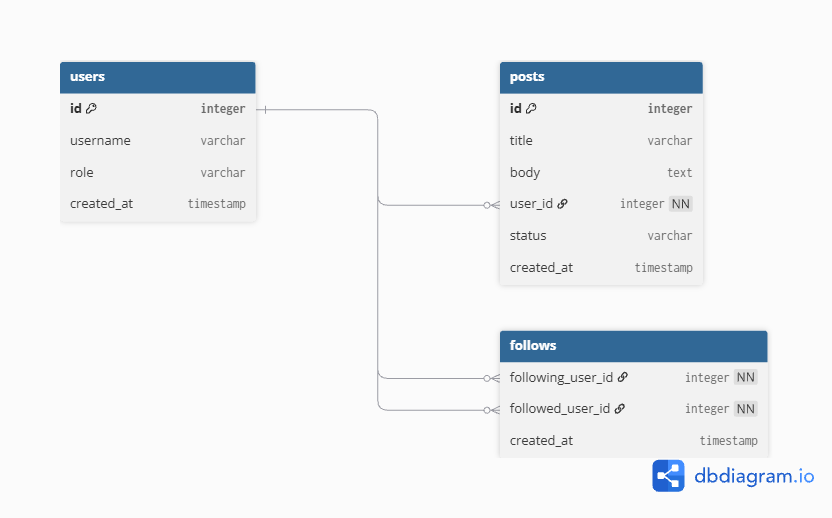
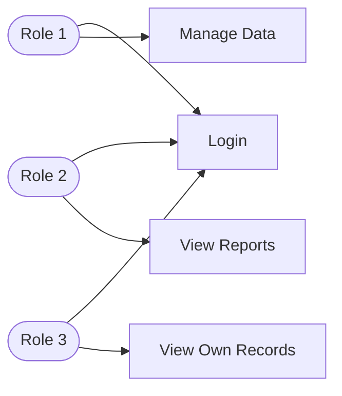

# Project Proposal: PHP + MySQL Application

> **Course:** J620-002-4:2020 Front-End Software Development (Level 4)
> **Competency Unit:** J620-002-4:2020-C01
> **Instructions:** Replace every `[ ... ]` and delete the hint lines (starting with `>`) before submitting. Keep this file as `README.md` in the root of your project repository.

---

## 1. Student Details

| Field | Your Answer |
|---|---|
| Candidate Name | [Lim Jing Hao] |
| NRIC Number | [080629070253] |
| Date Submitted | [ ... ] |

---

## 2. Project Title

**[simple reference and creative ideas]**

### One-line summary
[ Describe what your application does in one sentence. ]
something similiar to pinterest
---

## 3. Problem Statement & Purpose

> What problem does your application solve? Who is it for? Why is it useful?

[ solves user out of idea and have altrenate ideas , it is for artist  ,  useful for someone out of ideas and wanting for something]

---

## 4. Tech Stack

> Required: HTML, CSS, PHP, MySQL.

| Layer | Technology |
|---|---|
| Markup | HTML5 |
| Styling | CSS3 |
| Server-side | PHP |
| Database | MySQL |

---

## 5. Types of Users (Roles)

> Minimum **3 roles**. Each role must have different levels of access.

| Role | Description |
|---|---|
| [ Role 1, e.g. Admin ] | [ the user who owned this role able to access to everything ] |
| [ Role 2, e.g. Staff ] | [  the user who owned this role able to access certain things] |
| [ Role 3, e.g. Customer ] | [ the user owned this role only able to access something that only provided on the surface side] |

### Role-Based Access Matrix

> Mark what each role can do. Add or remove rows to match your features.

| Feature / Page | Admin | Staff | User | Guest (not logged in) |
|---|:---:|:---:|:---:|:---:|
| Register / Login | ✅ | ✅ | ✅ | ✅ |
| [ Access Control] | ✅ | ❌ | ❌ | ❌ |
| [ Content Moderation ] | ✅ | ✅ | ❌ | ❌ |
| [ User data management ] | ✅ | ✅ | ✅ | ❌ |

---

## 6. Features

### 6.1 Core Features (must have)

- [ ] User registration and login
- [ ] Role-based access control (each role sees/does different things)
- [ ] Data management (Create, Read, Update, Delete)
- [ ] [ Engagement (likes/comments)]
- [ ] [ Search & discovery ]

### 6.2 Extra Features (nice to have)

- [ ] [ Content Creation & Sharing ]
- [ ] [ Boards & Organization ]

### 6.3 Feature Descriptions

> Briefly explain each core feature: what it does and which role uses it.

| Feature | Description | Role(s) |
|---|---|---|
| [User Accounts] | [Create and manage personal profiles, follow others, customize bio and settings] | [User, Admin ] |
| [ Content Moderation] | [ Remove inappropriate pins/boards, enforce community guidelines] | [ Admin , Staff ] |
| [Role Management ] | [ add/remove staff , assign permission , invite partners ] | [ Admin ] |

---

## 7. Data Management System

> Which data can users create, view, edit and delete? Who is allowed to do what?

| Data / Entity | Create | Read | Update | Delete |
|---|---|---|---|---|
| [ user data ] | [ user ,staff ,admin] | [staff ,admin ] | [user ,staff ,admin ] | [ user ,staff ,admin ] |
| [Content  data  ] | [ user ,staff ,admin] | [staff ,admin ] | [user ,staff ,admin ] | [ user ,staff ,admin ] |    
|[ Ads data]| [Staff , Admin ] | [ Staff , Admin ]| [Staff , Admin ]| [Staff , Admin ]|
---

## 8. Database Design

> Minimum **4 tables** with at least **3 linkages** (foreign keys) between them.

### Entity Relationship Diagram (ERD)

> Create your own ERD for your database and place it here. You can draw it in draw.io or dbdiagram.io and insert the exported image (e.g. ``), or write it in Mermaid.

---

## 9. Use Case Diagram

> Show the actors (roles) and what each can do in the system. Use a Mermaid flowchart below, or export an image from draw.io / Lucidchart to `docs/usecase.png`.

---

## 10. Presentation Checklist

- [ ] Can explain the purpose of the application
- [ ] Can justify design choices (why this database structure, why these roles)
- [ ] Can demo every role
- [ ] Can answer questions about my own code
- [ ] Submitted on time
